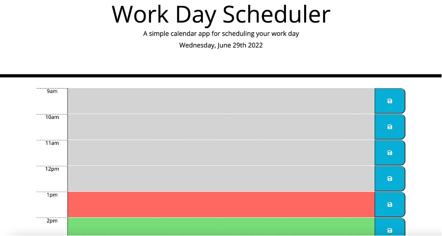

ONLINE QUIZ

Week 5 Challenge: Creating a day work schedule

Live link: https://ogray96.github.io/WorkDayScheduler/

This week for the weekly challenge the task was to complete the code that was provided to us. This involved creating a day scheduler for the final user. The webpage was required to display the current date at the top of the page. Furthermore, cosmetically future time periods should be coloured green, current time should be coloured red. Past times should be grey.

Finally the utility of the website should be that the user can write their to do items in each hours box and when they click the save icon it should save the to do item into local storage. As a result the to do will still remain when the user reloads the page.

